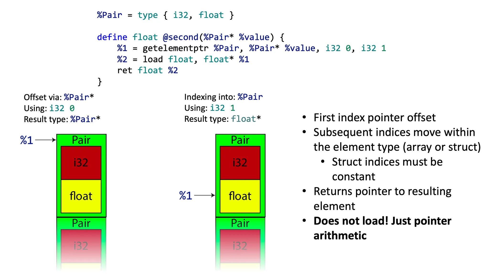

# Lab_09 Let's Support More Operators And Pointer Type.

## How to determine the type of an array in C language?

Ok, at first, one-dimensional array is easy to understand for everyone.

```C
int a[10] = {0,1,2};
```

However, what about the array with more than one dimension?  Just like this:

```C
int a[2][3] = { {1, 2, 3}, {4, 5, 6} };
```

While analyzing the dimensions of an array, we should start at its innermost dimension, i.e., we should **look from right to left**.

In this example:
- 1st dimension: We have 3 integers, i.e. `int[3]`
- 2nd dimension: We have 2 `int[3]`, i.e. `int [2][3]`.

This example implies that we need to use **Recursion Method(Backtracing Method)** to determine the type of an array.

As a comparsion, let's recall how we determined the type of a pointer.

For example:

```C
int** p;
```

We just need to **look from left to right** simply.
- 1st dimension: We have a pointer which point to `int` data, i.e. `int*`.
- 2nd dimension: We have a pointer which point to `int*` data, i.e. `int**`.

## Tasks

### Task 1

Support the declaration of array.

```EBNF
init-declarator-list ::= declarator (= initializer)? ("," declarator (= initializer)?)*
decl-spec  ::= "int"
declarator ::= "*"* direct-declarator
direct-declarator ::= identifier | direct-declarator "[" assign "]" 
```

And in code generating stage, we should create the corresponding LLVM type in our compiler:

```cpp
llvm::Type * CodeGen::VisitArrayType(CArrayType *ty) {
    llvm::Type *elementType = ty->GetElementType()->Accept(this);
    return llvm::ArrayType::get(elementType, ty->GetElementCount());
}
```

### Task 2

Support the initialization of array.

```ebnf
initializer ::= assign | "{" initializer ("," initializer)*  "}"
```

To finish this task, we should:
 1. In **parsing stage**, collect all the initial values with the corresponding position(i.e. index) of them into a data structure (`std::vector<std::shared_ptr<InitValue>> init_values_`), which is a member of the declaration AST node.
 1. In **code generating stage**, traverse the data structure `init_values_`, and store each initial value into the correct position of the target array, according to the index infomation recorded in `init_values_`.

 The challenge of this task is that in order to implement storing data into a specified position of the target array, we should figure out how to use LLVM's api `CreateInBoundsGEP` correctly, which can generate the LLVM IR instruction `getelementptr`.

 

### Task 3

Support the subscription operator for accessing the element in an array.

```ebnf
postfix  ::= primary | postfix ("++"|"--") | postfix "[" expr "]"
```

### Task 4

Support the abstract declaration of an array type, which may appear with `sizeof` keyword.

```ebnf
type-name   ::= decl-spec abstract-declarator?
abstract-declarator ::= "*"* direct-abstract-declarator?
direct-abstract-declarator ::=  direct-abstract-declarator? "[" assign "]"
```

